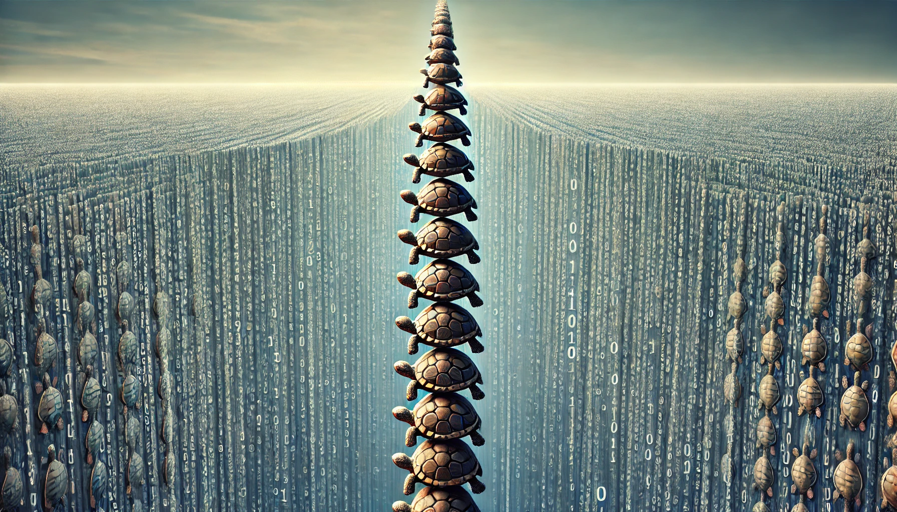

goal: get everyone on the same page before launching in
target audience: everyone... lol

I have no idea how to start this exactly, and I should probably apologize up front to those who need no clarifying.

Example of topic to cover:
At this point it seems like most cosmologist already agree that time isn't fundamental, but I still have to cover.

other stuff:
how information science seems more fundamental than physics.  A binary search is the same in any universe...

it from bit - why I think we need more / something deeper

how I came to this position / what kinds of questions I was asking / caring about that got me here

how growing up immersed in virtual worlds changes one's perspective

etc...

Why do we think there should be a final turtle in the stack?

I plan to argue that infinite regress isn't a bug, but a feature... and it should be noted that I resisted this STRONGLY for a long time.  But this isn't me throwing my hands up in surrender so much as being delightfully persuaded by logic.